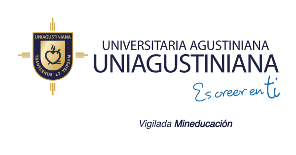

  

<h1 align="center">Curso de Python</h1>

---

Este repositorio contiene el material del curso virtual de Python dictado en la Universidad Agustiniana durante septiembre y octubre de 2023.

---

# 📕 Classes [▲](#top) <a id="classes">

## 0️⃣ [Introducción a Python](../clases/00_introduccion_python.md)

Una introducción a Python, un lenguaje de programación de alto nivel, interpretado, de tipado dinámico y multiparadigma.

## 1️⃣ [Variables y tipos de datos](../clases/01_variables_en_python.md)
Una introducción a las variables y tipos de datos en Python.

## 2️⃣ [Estructuras de control](../clases/02_estructuras_de_control.md)
Una introducción a las estructuras de control en Python, if, for, while y match.

# Autor [▲](#top) <a id="author">

[Sebastián Martínez](https://JuanS3.github.io/)

&#xa0;

<a href="#top">Back to top</a>